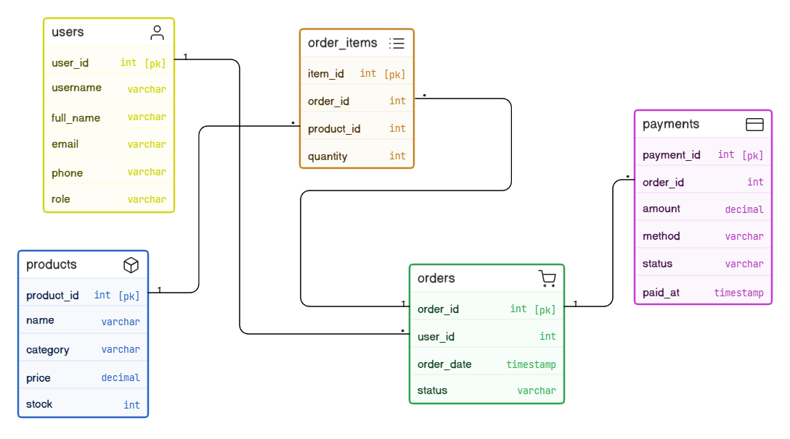
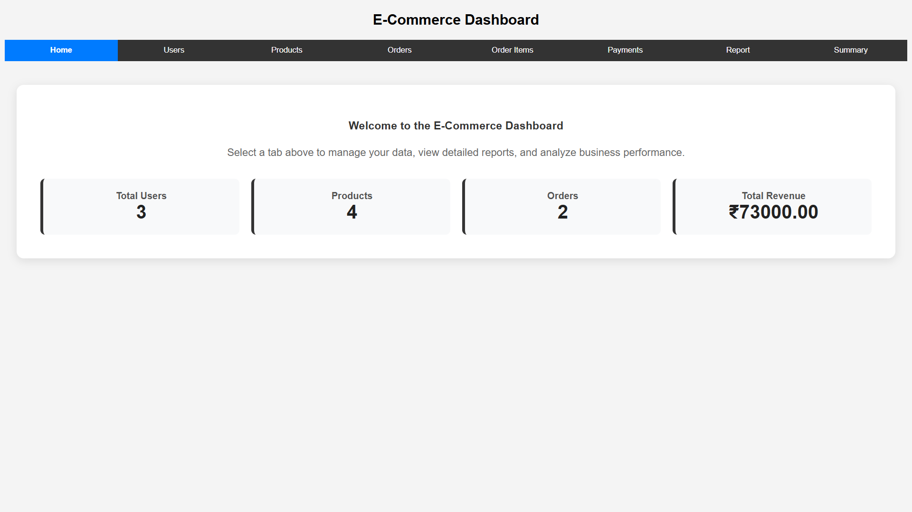
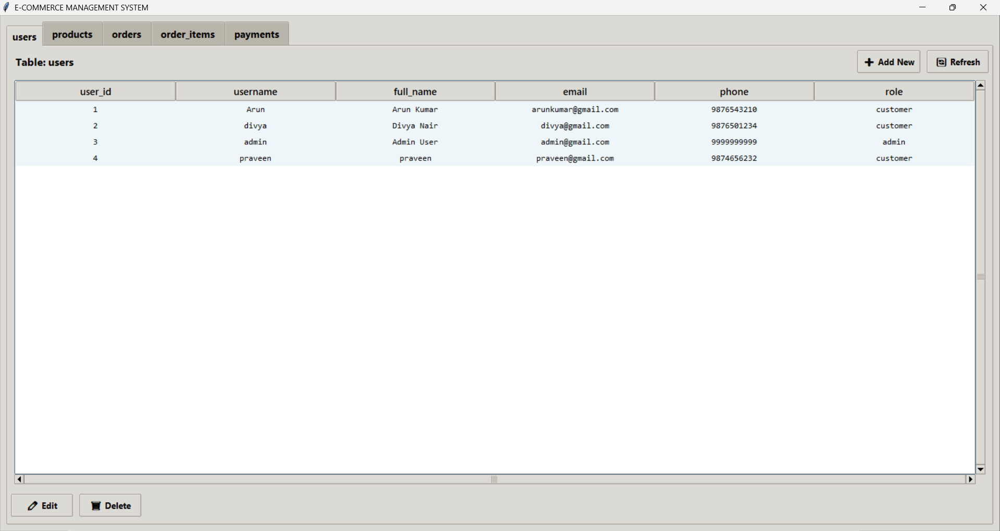

# E-Commerce Management System (MySQL + Flask + Tkinter)


> Originally developed as a **Database Lab Project**, this system was extended with a **Flask web interface** and a **Tkinter desktop application** to demonstrate complete end-to-end functionality.

---

## 🔥 Highlights

* Dual Interface System (**Web + Desktop**)
* Full CRUD Operations (Create, Read, Update, Delete)
* Advanced SQL JOIN Reporting
* Clean UI with structured navigation
* Real-time data updates

---

## 🚀 Features

### 🔹 Database (MySQL)

* Relational schema with normalization
* Foreign key relationships
* Tables:

  * Users
  * Products
  * Orders
  * Order Items
  * Payments

---

### 🔹 Desktop Application (Tkinter)

* Modern tab-based UI with interactive table view
* Form-based data entry and editing
* Full CRUD operations
* Real-time refresh of data

---

### 🔹 Web Application (Flask)

* Clean tab-based dashboard
* Displays all database tables
* Advanced **JOIN Report**
* Summary analytics:

  * Total orders per user
  * Total spending per user

---

## 🧱 Tech Stack

| Layer       | Technology     |
| ----------- | -------------- |
| Frontend    | HTML, CSS      |
| Backend     | Flask (Python) |
| Desktop App | Tkinter        |
| Database    | MySQL          |

---

## 📊 ER Diagram



---
## 📸 Screenshots

### 🔹 Web Dashboard



### 🔹 Desktop Application



---

## 📂 Project Structure

```bash
project/
│
├── app.py              # Flask web app
├── gui.py              # Tkinter CRUD application
├── templates/
│   └── index.html      # Web dashboard UI
├── database.sql        # Schema + sample data
├── requirements.txt
├── .env.example
└── README.md
```

---

## ⚙️ Setup Instructions

### 🔹 1. Clone Repository

```bash
git clone https://github.com/NAVEENKUMAR-T-GIT-28/ecommerce-system.git
cd ecommerce-system
```

---

### 🔹 2. Setup Database

#### Step 1: Create Database

Open MySQL and run:

```sql
CREATE DATABASE ecommerce_db;
USE ecommerce_db;
```

---

#### Step 2: Import Schema

Run the SQL file:

##### Option A: Using MySQL CLI

```bash
mysql -u root -p ecommerce_db < database.sql
```

##### Option B: Using MySQL Workbench (Import File)

1. Open MySQL Workbench
2. Select `ecommerce_db`
3. Go to **File → Open SQL Script**
4. Open `database.sql`
5. Click **Execute (⚡)**

##### Option C: Copy & Paste

1. Open MySQL Workbench
2. Select `ecommerce_db`
3. Copy contents of `database.sql`
4. Paste into query editor
5. Click **Execute (⚡)**

---

#### After Setup

Verify tables:

```sql
SHOW TABLES;
```


---

### 🔹 3. Setup Virtual Environment (Recommended)

```bash
python -m venv venv

# Windows
venv\Scripts\activate

# Mac/Linux
source venv/bin/activate
```

---

### 🔹 4. Install Dependencies

```bash
pip install -r requirements.txt
```

---

## 📦 Requirements

```
flask
mysql-connector-python
python-dotenv
```

---

### 🔹 5. Configure Environment Variables

Create a `.env` file in the root directory:

```
DB_HOST=localhost
DB_USER=root
DB_PASSWORD=your_password
DB_NAME=ecommerce_db
```

---

### 🔹 6. Run Flask Web App

```bash
python app.py
```

Open in browser:

```
http://127.0.0.1:5000/
```

---

### 🔹 7. Run Desktop GUI

```bash
python gui.py
```

---

## 📊 Key SQL Query (JOIN Report)

```sql
SELECT 
u.username,
o.order_id,
p.name AS product_name,
oi.quantity,
p.price,
(p.price * oi.quantity) AS item_total,
pay.amount AS order_total,
o.status,
pay.method,
pay.paid_at
FROM orders o
JOIN users u ON o.user_id = u.user_id
JOIN order_items oi ON o.order_id = oi.order_id
JOIN products p ON oi.product_id = p.product_id
JOIN payments pay ON o.order_id = pay.order_id;
```

---

## 📈 Output Example

| User | Product    | Qty | Item Total | Order Total |
| ---- | ---------- | --- | ---------- | ----------- |
| Arun | Laptop     | 1   | 50000      | 53000       |
| Arun | Headphones | 2   | 3000       | 53000       |

---

## 🎯 Learning Outcomes

* Database normalization
* SQL JOIN operations
* Full CRUD implementation
* GUI development using Tkinter
* Web development using Flask
* Multi-interface system design

---

## 🧠 Architecture

```
Tkinter GUI   ─┐
               ├── MySQL Database
Flask Web App ─┘
```

---

## 👨‍💻 Author

**NAVEENKUMAR T**

---

## 📌 Notes

* Ensure MySQL server is running
* Update database credentials in `.env`
* Compatible with Python 3.8+

---

## 🚀 Future Improvements

* Authentication system (Login/Register)
* Data visualization (charts & graphs)
* REST API integration
* Responsive frontend UI

---

## 📜 License

This project is licensed under the [MIT License](LICENSE).
